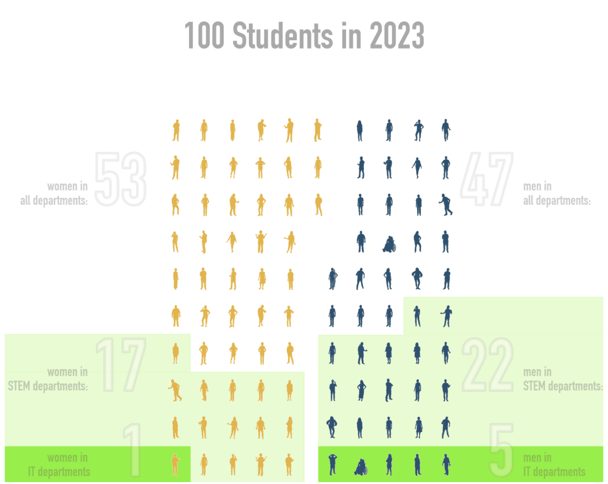
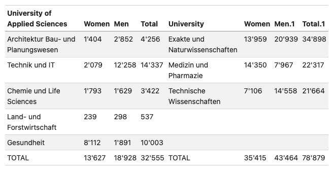
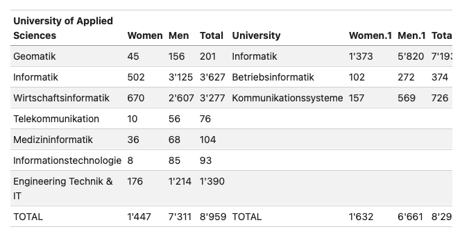
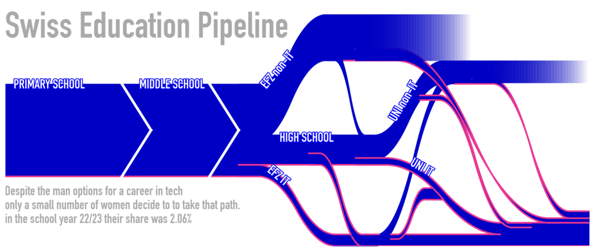
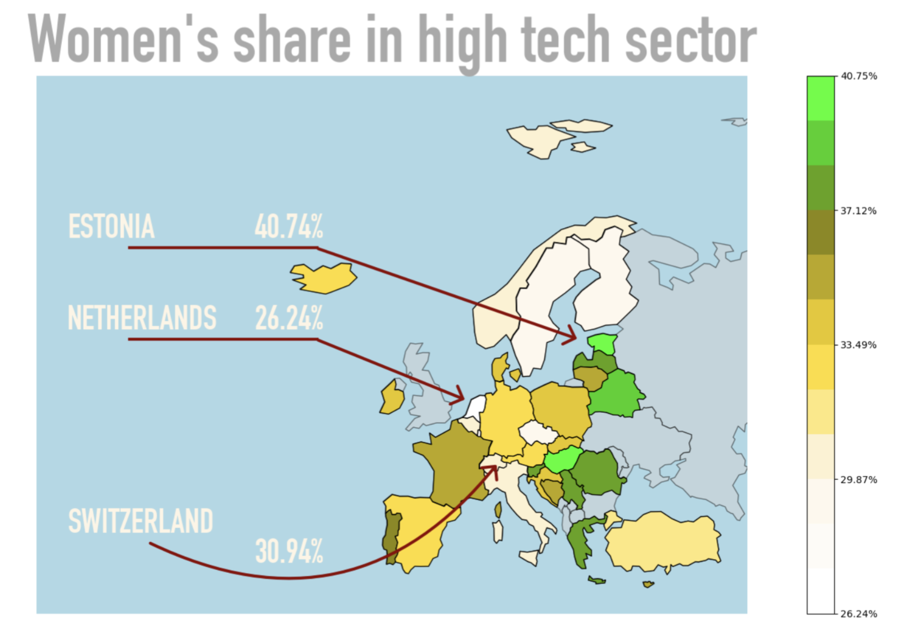
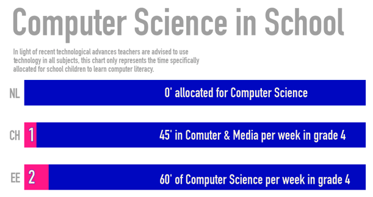

# beyond-the-binary

abstract: This document attempts to give a comprehensive overview of women in tech education in Switzerland based on federal data for the school year 22/23

author: Laura Livers 
date: June 10, 2024

## Gender Distribution in Swiss Universities
Since 2007 women have made up the majority of enrolled students in Swiss universities (**52.8%**). This is not surprising considering women also make up the majority in Swiss high schools - the most direct pipeline to a university degree. 

However when it comes to **STEM majors**, only a minority of all female students have chosen one of these fields (**17.73%**). If one looks only at the STEM departments themselves and ignores all other students, women make up 41.86% in those departments. The biggest driver for these numbers are healthcare related fields where women make up 81.1% (_Applied Sciences - health_), or 64.3% (_University - medicine and pharmaceutics_)

Once we zoom in to the tech departments the numbers get a lot worse. Over all the **IT-adjacent departments** women make up 17.84% of the student body. There is a slight difference between the _Applied Sciences_ (**16.5%**) and _University_ (**19.68%**). This may again be influenced by the fact that women, who are the majority in high schools (59.32%) where diplomas qualify them for both types of universities, are a minority in apprenticeships (41.79%), where diplomas qualify them only for applied sciences. All of those women together represent **2.11% of all women within the tertiary education pipeline**.

All of these numbers stem from [Bundesamt für Statistik](https://www.bfs.admin.ch/bfs/de/home/statistiken/bildung-wissenschaft/personen-ausbildung/tertiaerstufe-hochschulen.html) and have been agregated where necessary to calculate percentages as truthfully as possible

## The Many Paths not Taken

The Swiss education system by design is very complex. The idea behind is that there should be a path to a career for everyone, no matter their academic or practical inclination.
Since 1930 there is a dual-education system where young adults after completing their compulsory 9 years of education can join an apprenticeship at a company while simultaneously going to school. In the school year 22/23 there were were 240’722 young adults enrolled in this system, **100’605 of which were female (41.79%)**.

But despite the maningfold paths to a career in tech there appears to be a general hestiance in young women to chose such a profession. In the school year 22/23 there were a total of **5’560 women in a tech-focused education**:

- 2’013 in a vocational apprenticeship (EFZ)

- 468 in the higher vocational school (HF)

- 3’079 at a university

which represent 2.03% of all women in education at that point in time.
(high school excluded, as tech is not a specialisation available)

In comparison, at the same time there were **27’719 men in a tech-focused education**:

- 12’300 in a vocational apprenticeship (EFZ)

- 1’447 in the higher vocational school (HF)

- 13’972 at a university

which represent 9.13% of all men in education at that point in time.
_(high school excluded, as tech is not a specialisation available)_

## Working in the Tech World

It is well estiablished that academia does not always accurately represent reality. The same way that there are many, many paths through the education system, there are also many, many ways to train or retrain for a job. Therefor before drawing any conclusions about women in tech, we need to take a closer look on the job market. Based on a dataset from [Eurostat](https://ec.europa.eu/eurostat/databrowser/view/htec_emp_reg2/default/map?lang=en) **30.94%** of jobs in technology and knowledge-instensive sectors in Switzerland are held by women.

If we look at the Swiss percentage of 30.94% and apply it to the total number of women employed (2’195’000) we get **4.31%** of women working in the tech sector, or 94’600. Once we deduct women of foreign nationality (**23.93%**) - assuming they only entered the Swiss workforce, without having been a part of the Swiss education system - we get **71’962 female tech workers of Swiss nationality**. However, if we apply our education system percentage of 2.03% to the number of Swiss, female workers (1’669’736) we only get **33’896 women**. Which means **almost half of the Swiss women working in tech, did not go to school for it**.

## What is going on?
There are two key differences between women in the education system and women in the workforce:

- financial indepence

- age

As Switzerland has been an affluent country for the past 70 years, and at least on paper women have been allowed to chose their own career paths for the past 50 years, the financial incentive of the tech world is not as strong as for example in eastern European countries. Which leaves us with the suspicion that there might be an age-component to this problem:
**The older a woman, the more like she seems to be to chose a career in tech**.
The reasons behind this are outside of the scope of this project. However I would like to highlight a comparison between the Netherlands, Switzerland, and Estonia - three countries with high education and living standards and very different numbers.

## Coding the Future

Leaving aside societal bias about what a woman can or should be doing with her life, and how especially young people are influenced by such notions, looking at the education system of these three countries on the Primary School level appears to be very telling.

While all three countries highly encourage the use of computers in all subjects, so as to familiarise the students with its use, **only Estonia** specifically states that those two lessons are **Computer Science**. In Switzerland the subject **Computer & Media** entails everything from how to google for information to how the printing press was invented. And as a lot of Primary School teachers were not adequately instructed on how to teach computer literacy, the tend to focus on the latter. The Netherlands have **no lesson allocated** to Computer Sciences on the Primary School level.
Whether is the direct cause of the numbers of women in tech in those countries, will for now be left to debate.
Personally, I find it quite telling.

